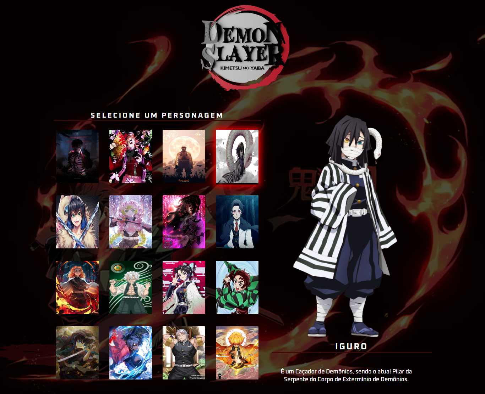

# battle-kimetsu-no-yaiba
 Menu de escolha dos personagens de kimetsu no yaiba, desenvolvido junto na live do dev em dobro. 

  

## 🖥️ Projeto
Projeto desenvolvido na live do Dev em Dobro, foi proposto a criação de um menu de escolha de personagem para batalhar. Meu tema escolhido foi de Kimetsu no Yaiba, aqui foi utilizado HTML, CSS e JAVASCRIPT onde quando passar o mouse por cima do card ele vai criar uma sombra de cor vermelha, além de mudar a imagem para o personagem escolhido do card e seu nome e descrição também.

## 🚀 Tecnologias
Foi desenvolvido esse projeto com as seguintes tecnologias:

- HTML
- CSS
- JAVASCRIPT
- GIT
- GITHUB
